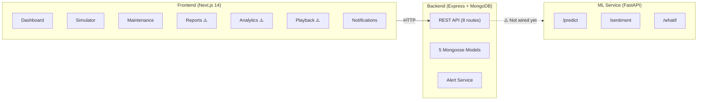

# Supply Chain EWS — Project Status Report

*Generated: March 13, 2026*

---

## Architecture Overview

> [!WARNING]
> Items marked ⚠️ are placeholders or not yet connected.

---

## ✅ Completed Work

### Frontend — Dashboard & Core UI

| Feature | File | Status |
|---------|------|--------|
| Disruption Index Gauge (animated SVG) | [DisruptionGauge.tsx](file:///d:/Supply%20Chain%20Disruption%20Early%20Warning%20System/frontend/src/components/DisruptionGauge.tsx) | ✅ Done |
| Active Critical Alerts (with actions) | [CriticalAlerts.tsx](file:///d:/Supply%20Chain%20Disruption%20Early%20Warning%20System/frontend/src/components/CriticalAlerts.tsx) | ✅ Done |
| Predictive Confidence (circular gauge) | [PredictiveConfidence.tsx](file:///d:/Supply%20Chain%20Disruption%20Early%20Warning%20System/frontend/src/components/PredictiveConfidence.tsx) | ✅ Done |
| Interactive Global Risk Heatmap (Leaflet) | [RiskHeatmap.tsx](file:///d:/Supply%20Chain%20Disruption%20Early%20Warning%20System/frontend/src/components/RiskHeatmap.tsx) | ✅ Done |
| Geopolitical Sentiment Feed (NLP table) | [SentimentFeed.tsx](file:///d:/Supply%20Chain%20Disruption%20Early%20Warning%20System/frontend/src/components/SentimentFeed.tsx) | ✅ Done |
| Automated Mitigation Suggestions | [MitigationSuggestions.tsx](file:///d:/Supply%20Chain%20Disruption%20Early%20Warning%20System/frontend/src/components/MitigationSuggestions.tsx) | ✅ Done |
| System Health Logs (progress bars) | [SystemHealth.tsx](file:///d:/Supply%20Chain%20Disruption%20Early%20Warning%20System/frontend/src/components/SystemHealth.tsx) | ✅ Done |
| Model Performance (Recharts line chart) | [ModelPerformance.tsx](file:///d:/Supply%20Chain%20Disruption%20Early%20Warning%20System/frontend/src/components/ModelPerformance.tsx) | ✅ Done |

### Frontend — Layout & Navigation

| Feature | Details | Status |
|---------|---------|--------|
| Wireframe-based 2-column dashboard | Main column (3-box row + heatmap) + Right sidebar (sentiment + mitigation + health) | ✅ Done |
| Collapsible sidebar (expand/collapse ◀▶) | Icon-only mode with smooth CSS transitions | ✅ Done |
| Responsive design | ≤1024px: right column below. ≤768px: single column, sidebar hidden | ✅ Done |
| Header with user profile | Dashboard View toggles, notification bell, date/time, avatar | ✅ Done |

### Frontend — Secondary Pages

| Page | File | Status |
|------|------|--------|
| Predictive Simulator ("WHAT-IF") | [simulator/page.tsx](file:///d:/Supply%20Chain%20Disruption%20Early%20Warning%20System/frontend/src/app/simulator/page.tsx) | ✅ Fully built (170 lines, sliders+results) |
| Maintenance & Model Perf | [maintenance/page.tsx](file:///d:/Supply%20Chain%20Disruption%20Early%20Warning%20System/frontend/src/app/maintenance/page.tsx) | ✅ Built (Health + Performance charts) |
| Notification Center | [notifications/page.tsx](file:///d:/Supply%20Chain%20Disruption%20Early%20Warning%20System/frontend/src/app/notifications/page.tsx) | ✅ Built (toggles + alert threshold) |

### Backend (Node.js / Express)

| Component | Details | Status |
|-----------|---------|--------|
| REST API | 8 route files: dashboard, alerts, shipments, news, health, model, notifications, whatif | ✅ Done |
| Mongoose Models | [Alert](file:///d:/Supply%20Chain%20Disruption%20Early%20Warning%20System/frontend/src/components/MitigationSuggestions.tsx#3-15), [Shipment](file:///d:/Supply%20Chain%20Disruption%20Early%20Warning%20System/frontend/src/lib/api.ts#24-29), `RiskScore`, [NewsArticle](file:///d:/Supply%20Chain%20Disruption%20Early%20Warning%20System/frontend/src/components/SentimentFeed.tsx#3-11), [ModelPerformance](file:///d:/Supply%20Chain%20Disruption%20Early%20Warning%20System/frontend/src/components/ModelPerformance.tsx#18-66) | ✅ Done |
| Alert Service | Automatic alert generation and management | ✅ Done |
| Seed Data | Realistic seed scripts for development | ✅ Done |
| MongoDB Config | Connection config with `.env` support | ✅ Done |

### ML Service (Python / FastAPI)

| Endpoint | Details | Status |
|----------|---------|--------|
| `/predict` | Risk prediction with feature engineering, returns risk scores | ✅ Done |
| `/sentiment/batch` | NLP sentiment analysis on news articles | ✅ Done |
| `/whatif` | Scenario simulation endpoint for the Predictive Simulator | ✅ Done |
| Models | Anomaly detection model, NLP pipeline | ✅ Done |

---

## ⚠️ Pending Tasks

### 1. Placeholder Pages (Frontend)

These 3 pages currently show static text — no charts or interactive content:

| Page | Current State | Planned Content |
|------|--------------|-----------------|
| [Reports](file:///d:/Supply%20Chain%20Disruption%20Early%20Warning%20System/frontend/src/app/reports/page.tsx) | Static cards saying "Coming soon" | Weekly Risk Trend (area chart), Top 5 At-Risk Routes (bar chart), Alert Frequency (stacked bar) |
| [Analytics](file:///d:/Supply%20Chain%20Disruption%20Early%20Warning%20System/frontend/src/app/analytics/page.tsx) | Single paragraph | Risk Distribution (histogram), Carrier Reliability (radar chart), Delay vs Prediction (scatter plot), Regional Comparison |
| [Playback](file:///d:/Supply%20Chain%20Disruption%20Early%20Warning%20System/frontend/src/app/playback/page.tsx) | Placeholder icon + text | Date range picker, timeline area chart, play/pause/speed controls, prediction validation metrics |

### 2. Backend ↔ ML Service Integration

The backend API routes and ML service endpoints both exist but are **not yet connected**:

| Integration | Backend Route | ML Endpoint | Status |
|-------------|--------------|-------------|--------|
| Risk prediction enrichment | [dashboard.js](file:///d:/Supply%20Chain%20Disruption%20Early%20Warning%20System/backend/routes/api/dashboard.js) → | `/predict` | ❌ Not wired |
| News sentiment scoring | [news.js](file:///d:/Supply%20Chain%20Disruption%20Early%20Warning%20System/backend/routes/api/news.js) → | `/sentiment/batch` | ❌ Not wired |
| What-if simulation | [whatif.js](file:///d:/Supply%20Chain%20Disruption%20Early%20Warning%20System/backend/routes/api/whatif.js) → | `/whatif` | ⚠️ Partially (frontend calls ML directly) |

### 3. Testing & Quality

| Item | Status |
|------|--------|
| Unit tests (frontend components) | ❌ None |
| Integration tests (API routes) | ❌ None |
| E2E tests (browser automation) | ❌ None |
| Error boundary components | ❌ Not implemented |
| Loading skeleton states | ❌ Not implemented |

---

## 🔮 Planned Future Features

| Feature | Priority | Complexity | Description |
|---------|----------|------------|-------------|
| **Page transition animations** | Medium | Low | `fadeIn` / `slideUp` keyframes between page navigations |
| **Loading skeletons** | Medium | Low | Shimmer placeholders while data fetches |
| **Authentication & RBAC** | High | High | JWT-based login, role-based dashboard access |
| **Real-time WebSockets** | High | Medium | Live alert push via Socket.io instead of 60s polling |
| **PDF report export** | Medium | Medium | Generate downloadable risk reports from the Reports page |
| **Docker Compose** | Medium | Low | Single `docker-compose up` for all 3 services + MongoDB |
| **Twilio/Email integration** | Low | Medium | Real SMS/email notifications via Twilio and Nodemailer |
| **CI/CD pipeline** | Low | Medium | GitHub Actions for build, test, and deploy |
| **Data retention policies** | Low | Low | Auto-archive old alerts and risk scores |

---

## Recommended Next Steps (Priority Order)

1. **Build out the 3 placeholder pages** — Reports, Analytics, Playback (all use Recharts with demo data, same pattern as existing pages)
2. **Wire Backend ↔ ML Service** — Add `axios` calls from backend routes to ML endpoints with fallback logic
3. **Add loading skeletons + page transitions** — Quick UX wins across all pages
4. **Write basic tests** — Start with API route integration tests and critical component unit tests
5. **Docker Compose** — Containerize all 3 services for easy deployment
